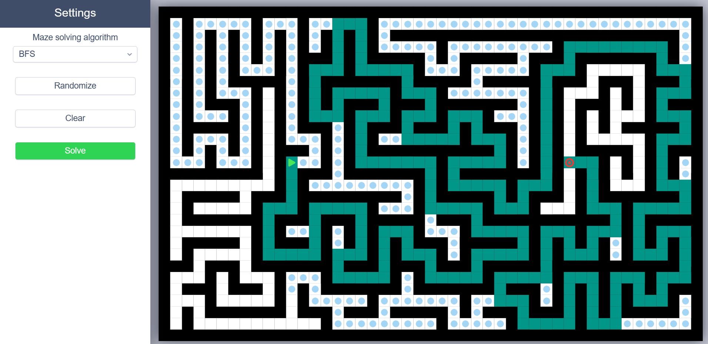
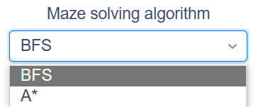

# Maze solver

 

This repository contains the source code of a web page that can generate and solve mazes using several algorithms. You can also move the start and the finish points.

The web page is online at the address : **[maze_solver.vercel.app](https://maze_solver.vercel.app)**.

 

	

 

# Summary

* **[Summary](#summary)**
* **[Features](#features)**
* **[Maze generation algorithms](#maze-generation-algorithms)
* **[Path finding algorithms](#pathfinding-algorithms)

 

# Features

* You can choose the path finding algorithm of the maze solver :

	

* You can move the start and the finish points :

* you are able to generate a maze with `DFS` algorithm:

* The `Clear` button allows you to clear the grid and the `Start` button runs the pathfinding algorithm

 

# Maze generation algorithm

* **Randomized Depth-First :**

	
	&nbsp;&nbsp;&nbsp;
	

 

# Path finding algorithms

* **Breadth-First** *(Slow but gives the shortest path)* **:**

	
	&nbsp;&nbsp;&nbsp;
	

* **A\*** *(Fast and gives the shortest path)* **:**

	
	&nbsp;&nbsp;&nbsp;
	

 
